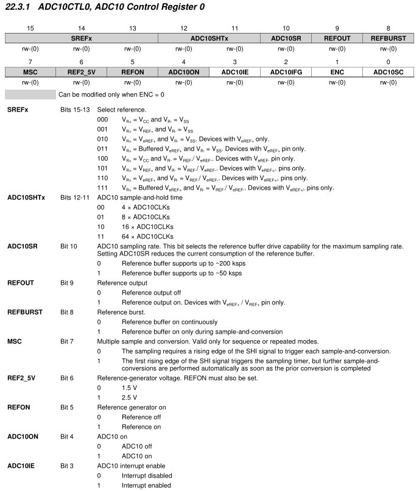
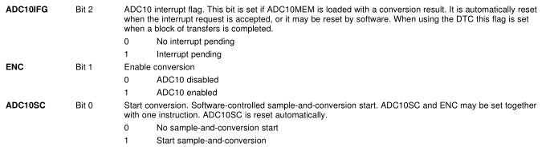
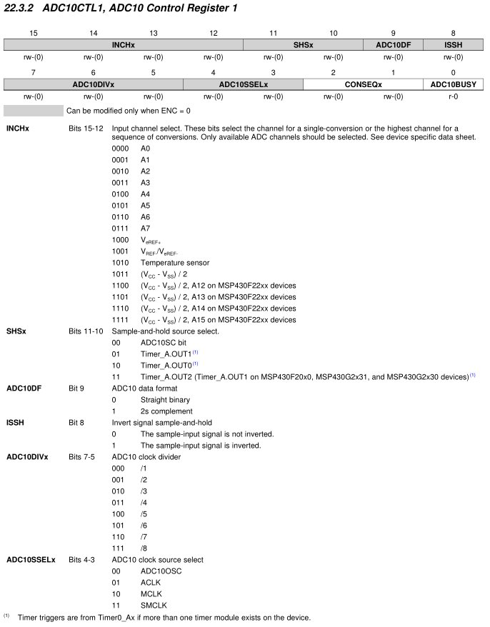
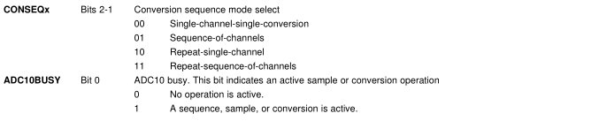
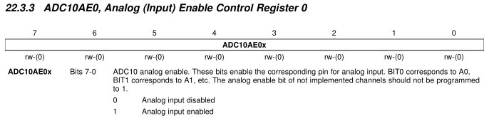

# ECE382 - Embedded Systems I

## Analog-to-Digital and Digital-to-Analog Conversion


## Lesson Outline
- Admin
- Robot Demo
- ADC Example Code
- The MSP430's ADC10
- Analog-to-Digital Conversion
- Digital-to-Analog Conversion
- Lab 7 / 8 Introduction


# Admin


# Robot Demo


# ADC Example Code


## ADC Example Code

```
// TI example code

#include <msp430g2553.h>

int main(void)
{
  WDTCTL = WDTPW + WDTHOLD;                 // Stop WDT
  ADC10CTL0 = ADC10SHT_3 + ADC10ON + ADC10IE; // ADC10ON, interrupt enabled
  ADC10CTL1 = INCH_4;                       // input A4
  ADC10AE0 |= BIT4;                         // PA.1 ADC option select
  ADC10CTL1 |= ADC10SSEL1|ADC10SSEL0;                // Select SMCLK
  P1DIR |= 0x01;                            // Set P1.0 to output direction

  for (;;)
  {
    ADC10CTL0 |= ENC + ADC10SC;             // Sampling and conversion start
    __bis_SR_register(CPUOFF + GIE);        // LPM0, ADC10_ISR will force exit
    if (ADC10MEM < 0x1FF)
      P1OUT &= ~0x01;                       // Clear P1.0 LED off
    else
      P1OUT |= 0x01;                        // Set P1.0 LED on
  }

    return 0;
}

// ADC10 interrupt service routine
#pragma vector=ADC10_VECTOR
__interrupt void ADC10_ISR(void)
{
  __bic_SR_register_on_exit(CPUOFF);        // Clear CPUOFF bit from 0(SR)
}c
```


## ADC10CTL0




## ADC10CTL0




## ADC10CTL1




## ADC10CTL1




## ADC10AE0




# The MSP430's ADC10


# Analog-to-Digital Conversion


# Digital-to-Analog Conversion


# Lab 7 / 8 Introduction


